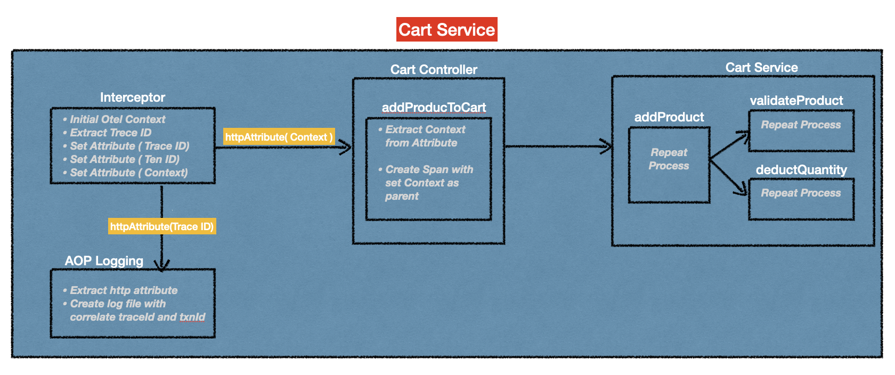

## Introduction
To configure instrumentation for passing the context propgation, actually there are 3 way of difference at following
* Automatic Instrumentation
* Automatic Instrumentation with Annotations
* Manual Instrumentation

<p align="center">
  
</p>

#### Automatic Instrumentation
In my previous [spring-boot-otel-context-propagation](https://github.com/santipabWannakiri/spring-boot-otel-context-propagation) POC project, I provided an example of automatic instrumentation configuration. It's really straightforward. We just load the OTEL library and the initial command, including setting the OTEL collector enpoint as the parameter environment. Then all the things will operate automatically. However, when the default instrumentation provided by the libraries or frameworks you are using is not sufficient for our specific use case or if we want to capture additional information that is not automatically captured by the existing instrumentation, manual instrumentation is the answer. It provides the flexibility to adapt observability to the unique requirements of your application. 


## Manual Instrumentation
As mentioned above, if default instrumentation is not sufficient or you want to capture something in deep detail, manual instrumentation is a solution. However, manual instrumentation is not easy to do. It's a really complex configuration, which I have summarized in the overview configuration step below:\
`1.Dependency configuration`\
`2.OTEL Builder configuraion` (Trace provider | Meter provider | Logger provider | Propagator)\
`3.Acquiring a Tracer`\
`4.Creating Spans`\
`5.Context Management` ( Context between classes and function | Context between services)

All of the steps above were ordered based on my experience, and most of them actually provide detailed configuration in the official OpenTelemetry document -> [Manual instrumentation for OpenTelemetry Java](https://opentelemetry.io/docs/languages/java/instrumentation/).\
Therefore, I'm going to focus on context management because it's really important and harder to understand how you will maintain context and pass it through the whole service.


## Context Management
OpenTelemetry context (context) is a crucial component for distributed tracing and observability in microservices architectures. By passing the context through your service, you enable end-to-end tracing and ensure that contextual information is available for diagnostics and analysis. 

When implementing OpenTelemetry (Otel) manually, there are 2 primary contexts to manage:
* Context between classes and function
* Context between services


## Context between classes and function approaches
This refers to sharing context within a service, where different classes or methods might need access to the same tracing information.

Common approaches:
##### 1. Method Arguments : Pass the context object as an argument to methods that require it.

##### 2. ThreadLocal Storage : Store the context in a thread-specific variable for access within methods of the same thread.

##### 3.  HTTP Attribute : Use HTTP attributes to pass contextual information within the scope of an HTTP request.

Above are all the approaches that I can imagine; however, each has pros and cons. For this POC, I decided to choose the `HTTP attribute`, whose details I'm going to provide detail at following:


<p align="center">
  
</p>

The illustration above provides the overall process of how it maintains context and passes it through between the class and function, which each component can describe as follows:

`Interceptor`: intercept and process the initial context, extract traceId etc. incoming HTTP requests before they reach the controller.

`AOP logging`: cross-cutting concerns like logging, and it requires a trace id and a txn id for logging.

`Controller`: Handle incoming HTTP requests and interact with the service layer.

`Service`: Implement business logic and perform operations requested by the controller.

For the details of how to coding, I would like to suggest that you take a look inside the project in each class that mentioned the illustration above.


## Context between services
This involves propagating context information across service boundaries. When your application spans multiple services or microservices, you need to ensure that trace context is passed between them. This is crucial for creating end-to-end traces that cover the entire flow of a request across different components.

Passing context between services is a crucial aspect of distributed tracing, and OpenTelemetry provides mechanisms to `inject context`, `extract context`, `Propagators` and `Carriers` for this purpose. Here's a brief explanation of how it works:

##### Injecting Context:
* When a service A initiates a request to service B, it needs to pass along the tracing context.
* OpenTelemetry provides the TextMapPropagator interface, allowing you to inject context into various carriers, such as HTTP headers or any key-value pair structure.
* The inject method is used to add trace information (e.g., trace ID, span ID) to the outgoing message (e.g., HTTP headers).

ex.
```java
openTelemetry.getPropagators().getTextMapPropagator().inject(Context.current(), headers, setter);
```

##### Extracting Context:
* When service B receives the request, it needs to extract the tracing context from the incoming message.
* OpenTelemetry provides the TextMapPropagator interface with an extract method to retrieve the trace information from the incoming carrier.

ex.
```java
 Context extractedContext = openTelemetry.getPropagators().getTextMapPropagator().extract(Context.current(), request, getter);
```

##### Propagators and Carriers:
* TextMapPropagator:
  * An interface defining methods for injecting and extracting trace context into/from carriers.
  * Includes methods like inject and extract.
* Carriers:
  * Carriers are representations of the data transport mechanism used to pass context.
  * Examples include HTTP headers, messaging system payloads, or any key-value pair structure.
* Setter and Getter:
  * Functional interfaces used to set and get values from the carrier.
  * For HTTP headers, a Setter might set values in the headers, and a Getter might retrieve values from the headers.

Example configure Setter and Gtter as Bean
```java

    @Bean
    public TextMapSetter<HttpHeaders> TextMapSetter() {
        return new TextMapSetter<HttpHeaders>() {
            @Override
            public void set(HttpHeaders carrier, String key, String value) {
                carrier.set(key, value);
            }
        };
    }

    @Bean
    public TextMapGetter<HttpServletRequest> TextMapGetter() {
        return new TextMapGetter<HttpServletRequest>() {
            @Override
            public Iterable<String> keys(HttpServletRequest carrier) {
                return Collections.list(carrier.getHeaderNames());
            }
            @Override
            public String get(HttpServletRequest carrier, String key) {
                return carrier.getHeader(key);
            }
        };
    }

```


<p align="center">
  
</p>


Considerations:
Concurrency Requirements: If your application involves multi-threading or asynchronous operations, ThreadLocal might not be the most suitable choice unless managed with caution. Method arguments or dependency injection might offer better thread safety.

Simplicity vs. Explicitness: ThreadLocal can simplify the code by avoiding explicit parameter passing, but it might make dependencies less visible compared to method arguments or dependency injection.

Project Scale: For larger projects with complex dependency management requirements, dependency injection might provide a more scalable solution. For smaller projects, a simpler approach like method arguments or ThreadLocal might suffice.

2. Context between services: This involves propagating context across network boundaries, typically between different microservices or components in a distributed system.
* Crucial for tracing: Enables end-to-end tracing by ensuring all services involved in a request share the same tracing context.
* Primary approach: Inject context into outgoing messages (e.g., HTTP headers, gRPC headers) using OpenTelemetry propagators.

```java
void inject(Context context, @Nullable C carrier, TextMapSetter<C> setter);
```
The inject method is a key component in this process. It allows you to inject trace context into a carrier, such as HTTP headers or messaging system properties, facilitating context propagation.

* context: OpenTelemetry context containing trace context information. ex (Traceparent: 00-0123456789abcdef0123456789abcdef-0123456789abcdef-01)
* carrier: Carrier where the context information will be injected (e.g., HTTP headers, messaging system properties).
* setter: Implementation of the TextMapSetter interface responsible for setting key-value pairs in the carrier.


[Medium - Context Propagation in OpenTelemetry](https://medium.com/@danielbcorreia/context-propagation-in-opentelemetry-3f53ab31bcf5)\
[Elastic - Manual instrumentation of Java applications with OpenTelemetry](https://www.elastic.co/blog/manual-instrumentation-of-java-applications-opentelemetry)\
[Otel - Manual instrumentation for OpenTelemetry Java](https://opentelemetry.io/docs/languages/java/instrumentation/)\
[Dynatrace - Manually instrument your Java application with OpenTelemetry](https://docs.dynatrace.com/docs/extend-dynatrace/opentelemetry/walkthroughs/java/java-manual)\
[OTLP Collector Setup](https://opentelemetry.io/docs/languages/java/exporters/)\
[Example setup OTLP](https://github.com/elastic/observability-examples/blob/main/Elastiflix/java-favorite-otel-manual/src/main/java/com/movieapi/FavoriteApplication.java)
